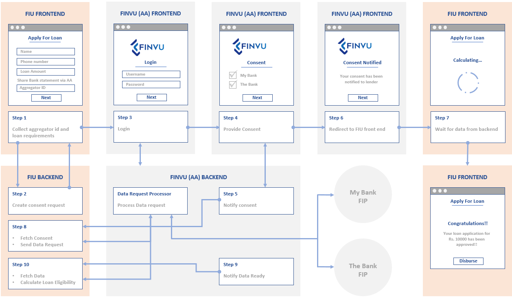

# Web UI integration with Finvu AA

The Finvu Webview integration end point enables seamless integration of FIU application with Finvu to provide frictionless user experience.

The Finvu Webview can be invoked by redirecting the FIU page to the Webview URL as an http GET request along with some URL parameters.

## Pre-Requisites

- You are registered with Finvu AA and have got a VUA e.g. `yourname@finvu`


### Understanding the Process flow

1.	FIU securely captures (preferably in a authenticated web session) user’s AA id from the FIU web user interface and submits to the FIU server
2.	FIU server generates a consent request (as per ReBIT specifications) with a unique consent request id
3.	FIU server encrypts the consent request and encodes with base 64 encoder
4.	FIU server sends redirection request to the web browser/webview along with FIU id, encoded consent request, unique consent request id and call back URL for  
    redirecting to Finvu AA Webview
5.	Browser/webview redirects the user to the Finvu domain
6.	Finvu AA webview performs user aa id authentication and processes consent request by seeking consent from user
7.	Based on user’s acceptance/rejection to the consent request, Finvu AA server sends status notification to FIU server along with consent request id
8.	Webview then redirects the user back to the FIU domain to the call back URL passed in the original request
9.	FIU can now proceed with checking the consent status with FIU server
10.	If the user has provided consent, the FIU server can proceed to data request and data fetch from Finvu AA server



### Integration Using the Finvu Finsense (FIU)

This is an easy 2 step integration process. 

#### Step 1. Server API for ConsentRequest (/TemplateConsentIntentRequest)

Root endpoint : `https://finsense.finvu.in/ConnectHub/FIU/API/V1`

This API is used for the Finvu Webview integration flow.

TemplateConsentIntentRequest generates consentHandleId and encryptedConsentRequest at FIU side and sends it to AA. 

Method: `POST`

Below `HTTP` headers need to be set when calling the API

  |  Key          |   Value       |	Description	|
  | ------------- |-------------|-------------|
  | `content-Type` | `application/json` | API request and response are in JSON format |
  | `Authorization` | `Bearer: token received after calling /User/Login`  | The token that was received after the `/User/Login` API was called. |
  
  

Sample Request
``` json
{
		"header": {
		"rid": "42c06b9f-cc5b-4a53-9119-9ca9d8e9acdb",
		"ts":  "2020-02-21T12:23:49.430+0000",
		"channelId": "finsense"
	},
		"body":{
			"custId": "customer1@finvu",
			"consentDescription": "Consent for a loan",
			"templateName": "Onetime Loan Consent"
	}
}
```

Body Parameters

  |  Name          |   Value       |	Description	|
  | ------------- |-------------|-------------|
  | `custId` | Valid Customer AA id (VUA) | Customer AA id |
  | `consentDescription` | Free text | Free text consent description field |
  | `templateName` | Valid template in Finvu Finsense (FIU)  | The name of the template created in Finvu Finsense. |
  
Sample Response

Response:
``` json
{
    "header": {
        "rid": "42c06b9f-cc5b-4a53-9119-9ca9d8e9acdb",
        "ts": "2020-02-21T12:23:51.430+0000",
        "channelId": "finsense"
    },
    "body": {
        "consentHandleId": "8a889427-9ba0-4449-a1a7-ca4dbbbf7c95",
        "encryptedConsentRequest": "jbSAZ0JPkpNYtJBbZAoSdCIU2MWEW4JQbE9iMBmKsH0PCHjkOZRUBxpyee/50aDXJuoCSePe+TPWK0kAu4KWh2QqFKkka+dqv5tHjDhcDAm2CDXcdCX0l+fgoLVf9lfiHfSKz2LQY4EeUDQR+7rE1/o1tIp1gb0xKaa/faJpqjMRXNkKmboE3eJbWEhFah2BG3zgkPvjJB7H5y3nNOl5T1HIwW8JeeH70c5UGzmPd9urDRYzR4xq7Pqpi6P6q9g9G6AvDrboKi5EvH1+ycqN9+i+DJ83Ld2xRx2iVWTiQBfr8z4QX53rXq4M8XY5GRlf7yb5TFoBT2DTqu+K0SPQs7NDjWWiCuMmA6yyMY+68W62mdjzgmqTtCLflsKYu/MKRO4XTSIM5ZFVEmK231o2LF8l1od9DoYrBA1VrojVAxM6C9aiYCkdPx/ywY72nInnpKxKc0yQrzsuZhcUgPFalI8avuXfSI9W29barQsr8CDH2butHv4cXN3ul3FYFzkAuOnrZDkEQnFQx5buer+/ZzsHP8eMEHYUDGIrCLpW6LF2//srT6s0vSUN7pEUOhA+0GHWHiQT7weiWPismCuzMP/ft+1Ik6+feyIQzyjozz3j6zl3LW2ZJ9t8fzaDgVi5TlE22WrcVIgheMlFcITiUl3tjiOAcCPWLmbkXObkqgeCqswPPBTMYDjFvZTP7DPeNnNiMbgObFA+Ct7S1ek5zcz1yLN6imAm+WBNJ9ddhGRU18jRRSsF+i6BnYJNqkOn/Wp+07QfiUvyjMkfDObL8/UHDrVG7Z/HeC8GxMh/ydgmAPtqVKISw0qR/ehBvFyN2r+/0Pbptlt/YgyAzCBnCnCXNTeYf4E9/RVfVLca5Bx/clEq1Am2dAgmrRrHDUKirAQ0JlHAXuOI1I6Z9/ANz4L3Wb/8Fdnc5Iy0LX6lV9xKweyhfaHapd8kBdf6aij8zmvHRQ2KTECGw9+OD37FtbtNll8CZWbLM+oSuQhixpmA1DqQ3nCoGUNjV+4NLpeePIuuRx+BbNKagK9aw/8VeV5mHrAqKhnfW+scgp6dVBmLfL9vSYrlncG3tpd0bLq0"
    }
}
```  

#### Step 2. Web URL Redirect Parameters

Please reach out to us on `support@cookiejar.co.in` for on-boarding and integration details as we are evolving. 

### Integration Using your FIU Platform

If you have your own custom FIU platform reach out to us on `support@cookiejar.co.in` for on-boarding and integration. 